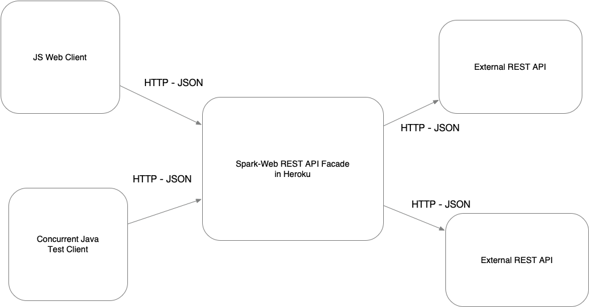
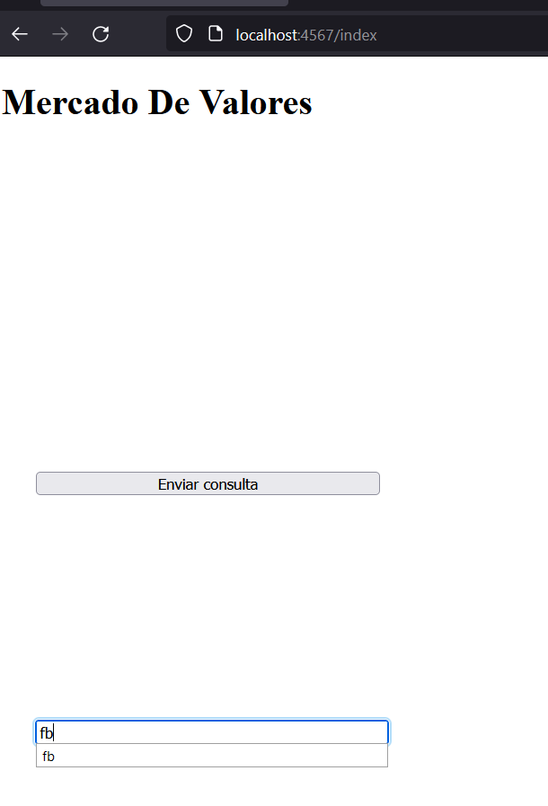
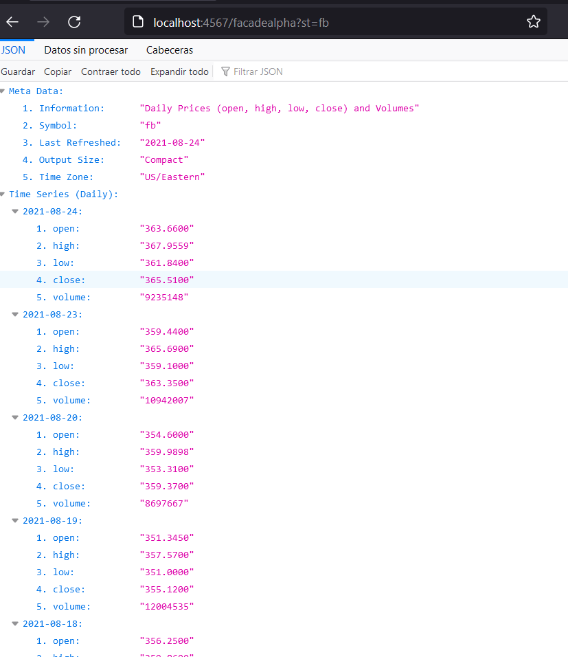

# Tarea 1 - ARERP 2021- 1 
## Juan Sebastian Garcia Hincapie

### Contenido 
esta es la implementacion de una aplicacion que permite consultar el mercado de valores de las acciones negociadas en Bolsa.  La aplicación recibirá el identificador de una acción, por ejemplo “MSFT” para Microsoft  y deberá mostrar el histórico de la valoración intra-día, diaria, semanal y mensual

### Modelo UML

### Ejecucion 

### herramientas usadas: 
-maven 
-spark 
-netbeans 
-github 
-heroku 

